# hum
Generate synthetic signals for ML pipelines


To install:	```pip install hum```

# functionality
This notebook gathers various examples of the functionality of `hum`:
- Synthetic datasets
    - sound-like datasets
    - diagnosis datasets
    - signal generation
- Plotting and visualization
    - plot
    - display
    - melspectrograms
- Infinite waveform from spectrums
- Various sample sounds
- Voiced time


```python
from hum import (mk_sine_wf, 
                 freq_based_stationary_wf, 
                 BinarySound, 
                 WfGen, 
                 TimeSound, 
                 mk_some_buzz_wf, 
                 wf_with_timed_bleeps,
                 Sound,
                 plot_wf,
                 disp_wf,
                 InfiniteWaveform,
                 Voicer, 
                 tell_time_continuously,
                 random_samples,
                 pure_tone,
                 triangular_tone,
                 square_tone,
                 AnnotatedWaveform,
                 gen_words,
                 categorical_gen,
                 bernoulli_gen,
                 create_session,
                 session_to_df
                )
import matplotlib.pyplot as plt
from numpy.random import randint
import numpy as np
```

## Synthetic datasets
There are several different forms of synthetic data that `hum` can produce to be used in machine learning pipelines, with the first being sound-like datasets generally in the form of sine waves 

### Sound-like datasets

`mk_sine_wf` provides an easy way to generate a simple waveform for synthetic testing purposes


```python
DFLT_N_SAMPLES = 21 * 2048
DFLT_SR = 44100
wf = mk_sine_wf(freq=5, n_samples=DFLT_N_SAMPLES, sr=DFLT_SR, phase=0, gain=1)
plt.plot(wf);
```


    
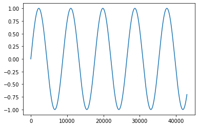
    


```python
wf = mk_sine_wf(freq=20, n_samples=DFLT_N_SAMPLES, sr=DFLT_SR, phase = 0.25, gain = 3)
plt.plot(wf);
```


    
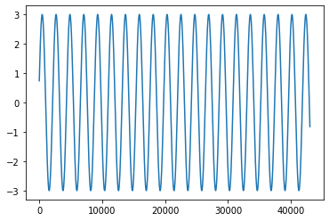
    


`freq_based_stationary_wf` provides the ability to generate a more complex waveform by mixing sine waves of different frequencies with potentially different weights


```python
wf_mix = freq_based_stationary_wf(freqs=(2, 4, 6, 8), weights=None,
                             n_samples = DFLT_N_SAMPLES, sr = DFLT_SR)
plt.plot(wf_mix);
```


    

    


```python
wf_mix = freq_based_stationary_wf(freqs=(2, 4, 6, 8), weights=(3,3,1,1),
                             n_samples = DFLT_N_SAMPLES, sr = DFLT_SR)
plt.plot(wf_mix);
```


    
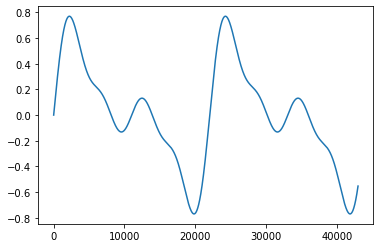
    


`WfGen` is a class that allows for the generation of sinusoidal waveforms, the generation of lookup tables to be used in generating waveforms, and frequency weighted mixed waveforms


```python
wfgen = WfGen(sr=44100, buf_size_frm=2048, amplitude=0.5)
lookup = np.array(wfgen.mk_lookup_table(freq=880))
wf = wfgen.mk_sine_wf(n_frm=100, freq=880)
```


```python
np.array(lookup).T
```


    array([ 0.        ,  0.06252526,  0.12406892,  0.1836648 ,  0.24037727,
            0.293316  ,  0.34164989,  0.38462013,  0.42155213,  0.45186607,
            0.47508605,  0.49084754,  0.49890309,  0.49912624,  0.49151348,
            0.47618432,  0.45337943,  0.42345682,  0.38688626,  0.34424188,
            0.29619315,  0.24349441,  0.186973  ,  0.12751624,  0.06605758,
            0.00356187, -0.05898977, -0.12061531, -0.18034728, -0.23724793,
           -0.29042397, -0.33904057, -0.38233448, -0.41962604, -0.45032977,
           -0.47396367, -0.4901567 , -0.49865463, -0.49932406, -0.49215447,
           -0.47725843, -0.45486979, -0.42534003, -0.38913276, -0.34681639,
           -0.29905527, -0.2465992 , -0.19027171, -0.13095709, -0.06958655])


```python
plt.plot(wf);
```


    

    


```python
wf_weight = wfgen.mk_wf_from_freq_weight_array(n_frm=10000, freq_weight_array=(10,1,6))
plt.plot(wf_weight);
```


    

    


### Diagnosis datasets
`hum` can also produce diagnosis datasets to be applied to machine learning pipelines

`BinarySound` is a class that generates binary waveforms


```python
bs = BinarySound(nbits=50, redundancy=142, repetition=3, header_size_words=1)
utc = randint(0,2,50)
wf = bs.mk_phrase(utc)
plt.plot(wf[:200]);
all(bs.decode(wf) == utc)
```


    True


    
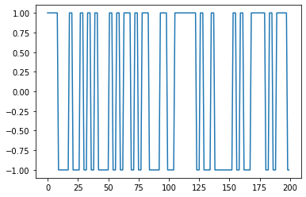
    


`BinarySound` can also be instantiated using audio parameters using the `for_audio_params` class method


```python
bs = BinarySound.for_audio_params(nbits=50, freq=6000, chk_size_frm=43008, sr=44100, header_size_words=1)
wf = bs.mk_phrase(utc)
plt.plot(wf[:200]);
all(bs.decode(wf) == utc)
```


    True


    
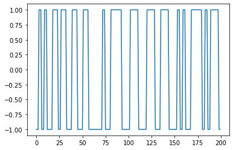
    


utc phrases can be generated using `mk_utc_phrases` when `BinarySound` is instantiated with audio parameters


```python
plt.plot(bs.mk_utc_phrases()[:200]);
```


    
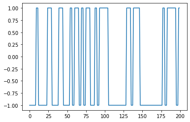
    


`TimeSound` is a class that generates timestamped waveform data


```python
time = TimeSound(sr=44100, buf_size_frm=2048, amplitude=0.5, n_ums_bits=30)
wf = time.timestamped_wf()
plt.plot(wf[2000:2300]);
```


    
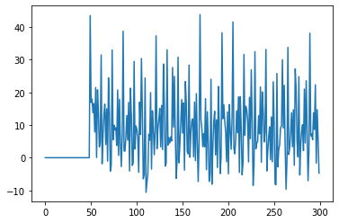
    


`mk_some_buzz_wf` and `wf_with_timed_bleeps` are two more options to generate synthetic data of diagnosis sounds


```python
wf = mk_some_buzz_wf(sr=DFLT_SR)
plt.plot(wf[:500]);
```


    
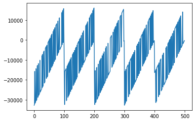
    


```python
wf = wf_with_timed_bleeps(n_samples=DFLT_SR*2, bleep_loc=400, bleep_spec=100, sr=DFLT_SR)
plt.plot(wf[:150]);
```


    
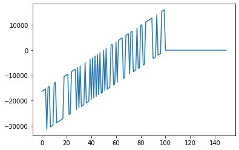
    


### Signal generation

`hum` can create signals generated by sequences of symbols, perturbed by outliers injected at given points


```python
symb_res = categorical_gen(gen_words)
out_res = bernoulli_gen(p_out=0.01)
df = session_to_df(create_session(symb_res, out_res, alphabet=list('abcde'), session_length=500))
df.plot(subplots=True, figsize=(20,7));
```


    
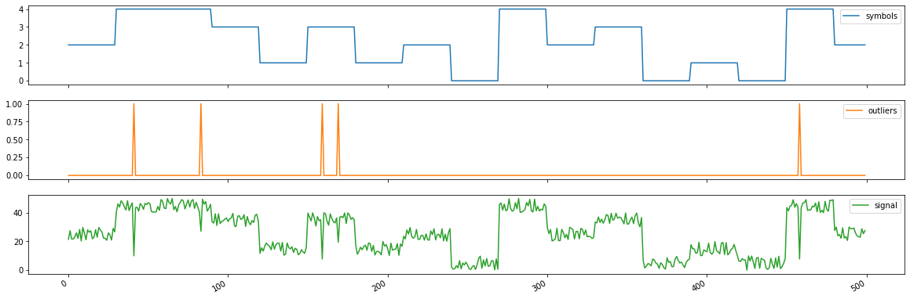
    


## Plotting and visualization
`hum` also provides several options for plotting and visualization for the synthetic datasets it generates


```python
wfgen = WfGen()
wf = list()
for i in range(1, 1000, 20):
    wf.extend(list(wfgen.mk_sine_wf(n_frm=2048, freq=i)))
wf = np.array(wf)
sr = 44100
```

### Plot waveform


```python
plot_wf(wf[:20000], sr)
```


    
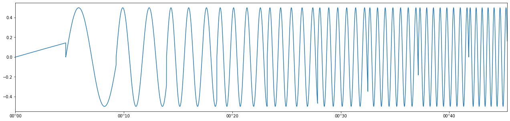
    


### Display waveform


```python
disp_wf(wf, sr)
```


    
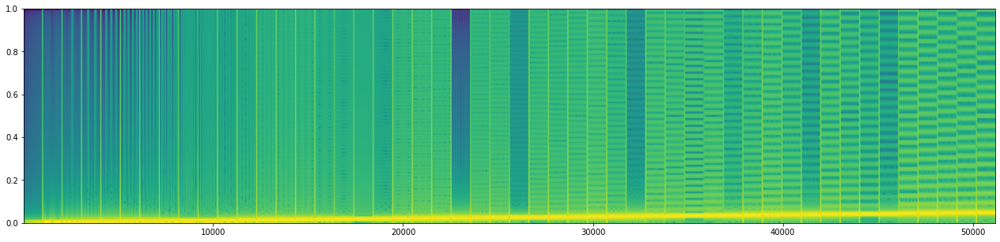
    


### Melspectrograms with `Sound`


```python
snd = Sound(wf=wf, sr=sr)
```


```python
snd.plot_wf(wf=wf[:20000], sr=sr)
```


    

    


```python
snd.melspectrogram(plot_it=False)
```


    array([[-63.34856485, -45.14910401, -36.14726097, ..., -80.        ,
            -73.35788085, -60.58728436],
           [-67.99632241, -74.80503122, -80.        , ..., -80.        ,
            -72.1600597 , -60.16803079],
           [-80.        , -80.        , -80.        , ..., -80.        ,
            -72.90050429, -60.90871386],
           ...,
           [-80.        , -80.        , -80.        , ..., -80.        ,
            -80.        , -80.        ],
           [-80.        , -80.        , -80.        , ..., -80.        ,
            -80.        , -80.        ],
           [-80.        , -80.        , -80.        , ..., -80.        ,
            -80.        , -80.        ]])


```python
snd.display()
```


    
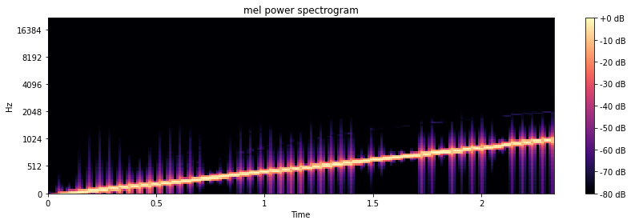
    


## Infinite waveform from spectrum
`hum` also provides the functionality to create an infinite waveform based on a given spectrum, and a noise amplifier if desired


```python
iwf = InfiniteWaveform(wf)
```


```python
wf = list(iwf.query(0,500000))
```


```python
disp_wf(wf)
```


    
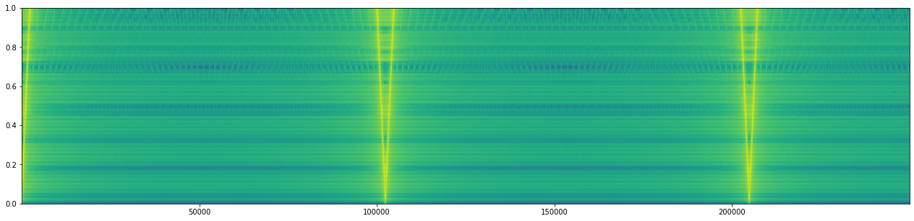
    


```python
Sound(wf=wf).display()
```


    
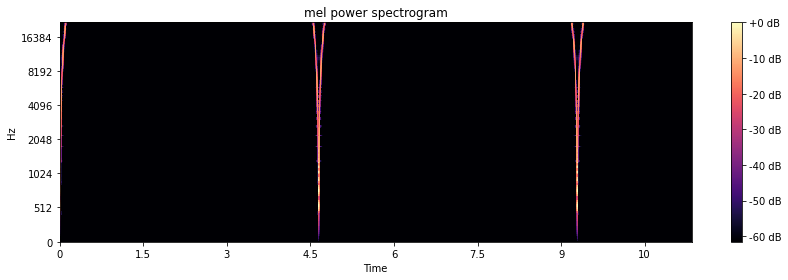
    


## Sample sounds
`hum` also provides several functions to generate sample sounds shown below

### Random sample


```python
wf = random_samples(chk_size_frm=21*2048, max_amplitude=30000)
disp_wf(wf=wf, sr=sr)
Sound(wf=wf).display()
```


    
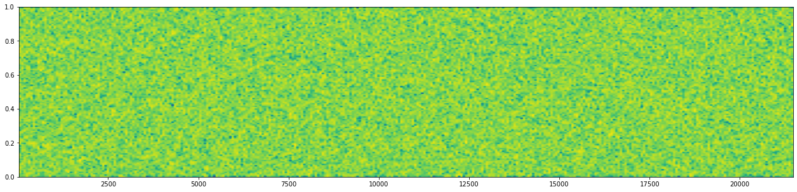
    


    

    


### Pure tone sample


```python
wf = pure_tone(chk_size_frm=21*2048, freq=440, sr=44100, max_amplitude=30000)
disp_wf(wf=wf, sr=sr)
Sound(wf=wf).display()
```

    /Users/owenlloyd/opt/anaconda3/envs/oto3/lib/python3.8/site-packages/matplotlib/axes/_axes.py:7723: RuntimeWarning: divide by zero encountered in log10
      Z = 10. * np.log10(spec)


    
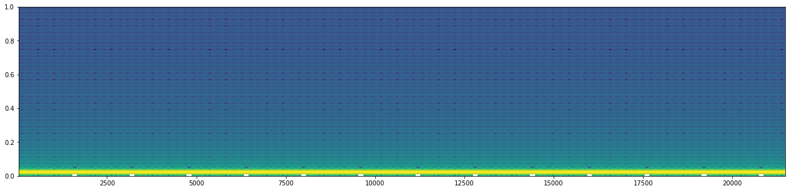
    


    
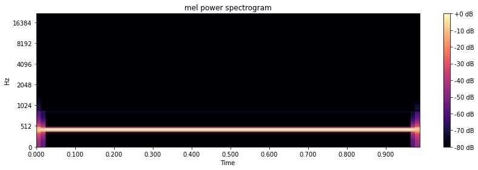
    


### Triangular tone sample


```python
wf = triangular_tone(chk_size_frm=21*2048, freq=440, sr=44100, max_amplitude=30000)
disp_wf(wf=wf, sr=sr)
Sound(wf=wf).display()
```


    
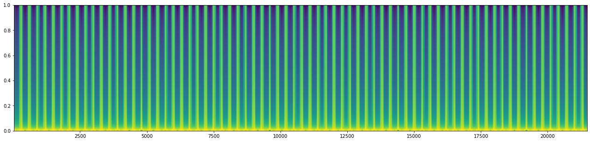
    


    
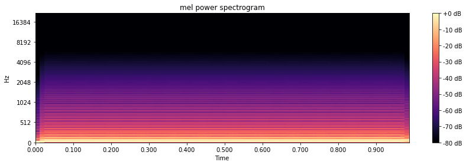
    


### Square tone sample


```python
wf = square_tone(chk_size_frm=21*2048, freq=440, sr=44100, max_amplitude=30000)
disp_wf(wf=wf, sr=sr)
Sound(wf=wf).display()
```


    
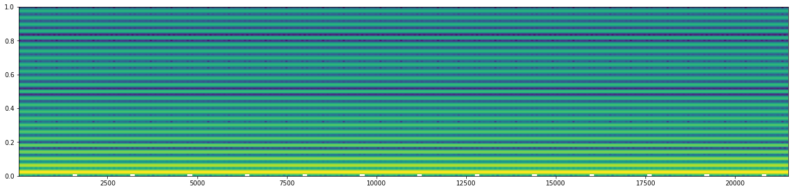
    


    
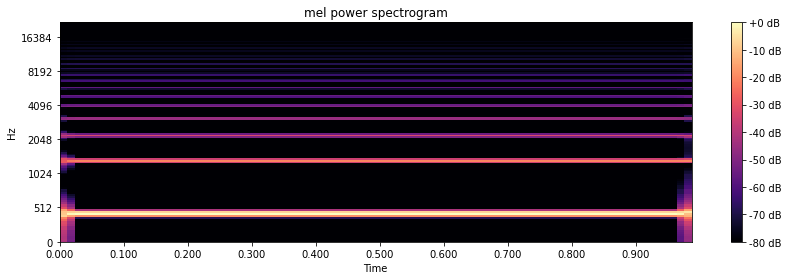
    


### Annotated Waveform


```python
awf = AnnotatedWaveform(chk_size_frm=21*2048, freq=440, sr=44100, max_amplitude=30000)
gen = awf.chk_and_tag_gen()
list(gen)
```


    [(array([-14025,  11555,  22270, ...,  10243, -18225,   3874], dtype=int16),
      'random'),
     (array([    0,  1902,  3797, ...,  9361, 11149, 12893], dtype=int16),
      'pure_tone'),
     (array([-30000, -29900, -29800, ...,  10500,  10600,  10700], dtype=int16),
      'triangular_tone'),
     (array([30000, 30000, 30000, ..., 30000, 30000, 30000], dtype=int16),
      'square_tone')]


```python
awf.get_wf_and_annots()
```


    (array([  5183,  10421, -21645, ...,  30000,  30000,  30000], dtype=int16),
     {'random': [(0, 43008)],
      'pure_tone': [(43008, 86016)],
      'triangular_tone': [(86016, 129024)],
      'square_tone': [(129024, 172032)]})


## Voiced time
Finally `hum` provides a function that will tell the time continuously with parameters for the frequency, speed, voice, volume, and time format


```python
tell_time_continuously(every_secs=5, verbose=True)
```

    15 45 11
    15 45 16
    15 45 21
    15 45 26
    KeyboardInterrupt!!!

